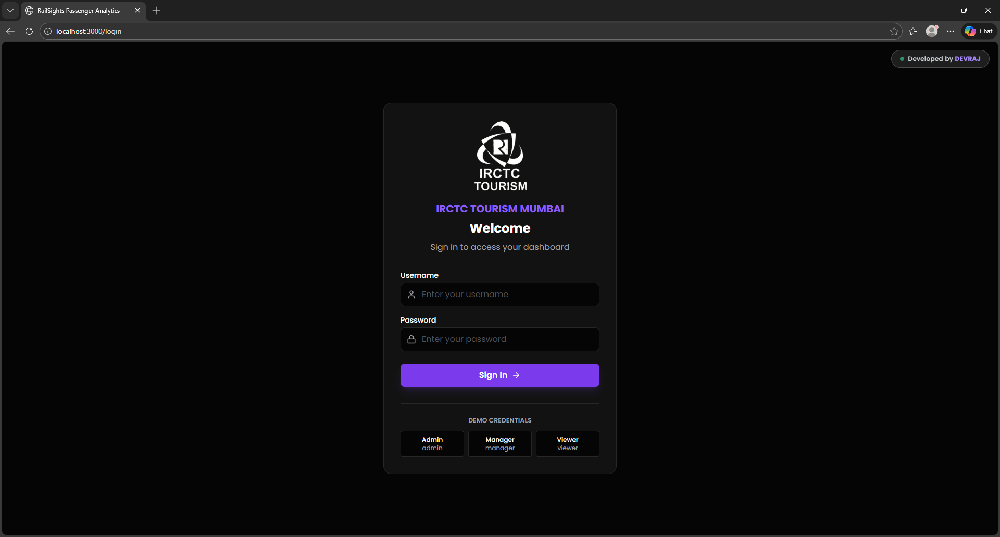
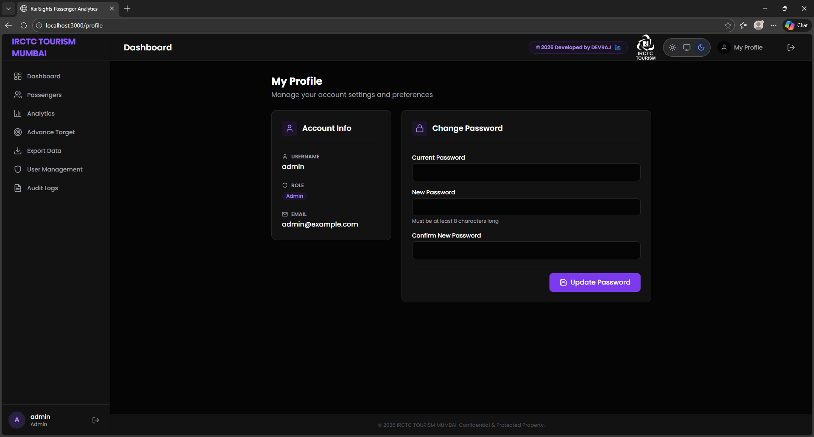
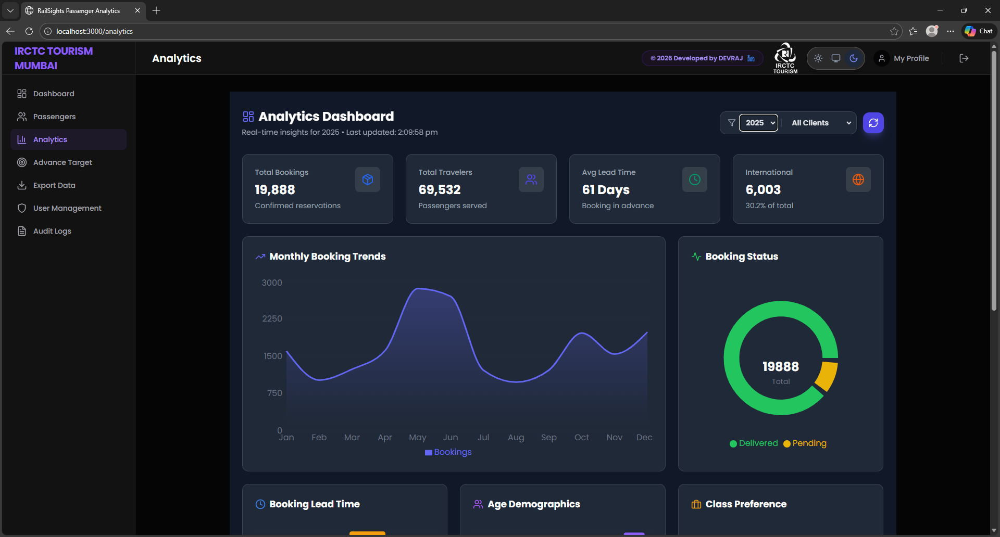
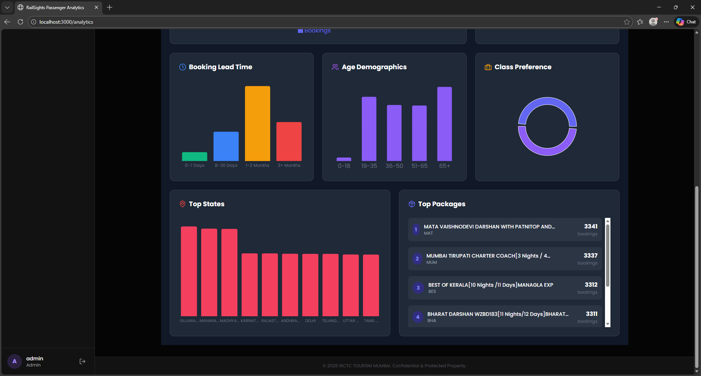
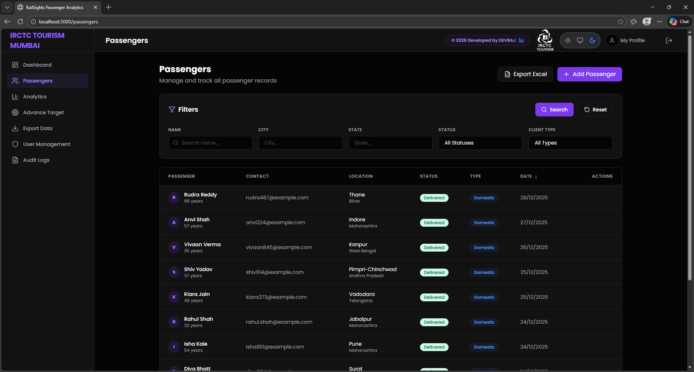
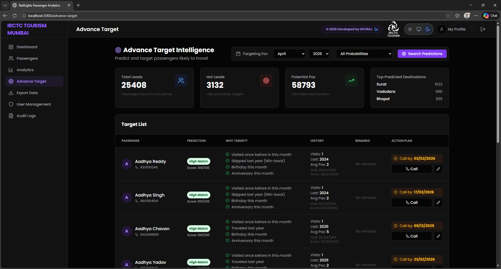
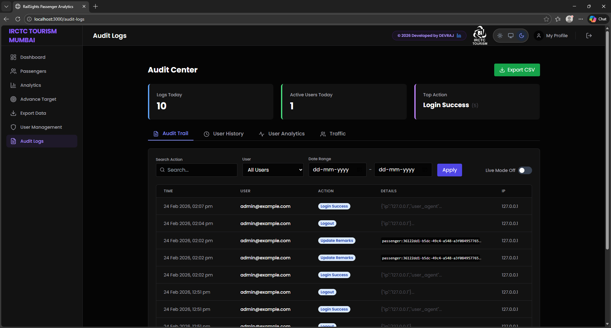
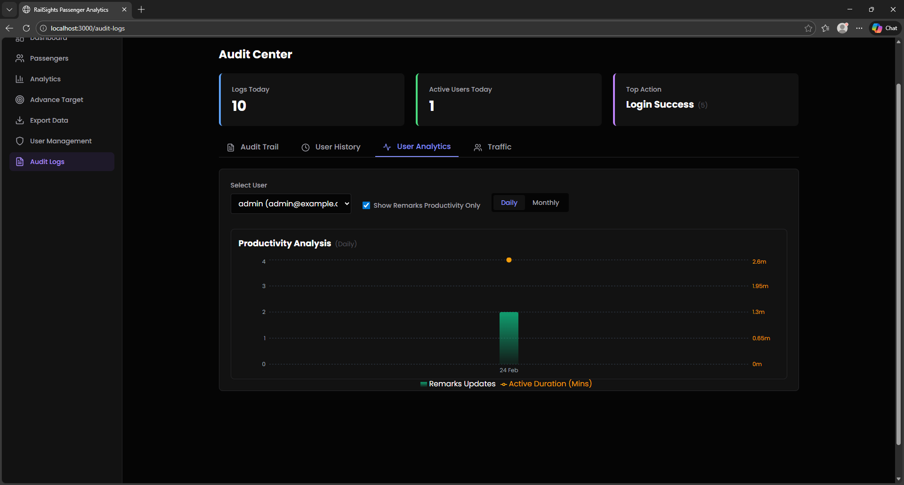
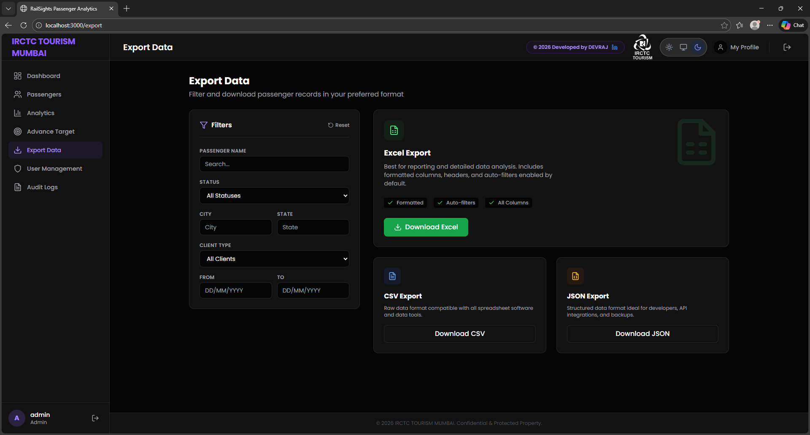
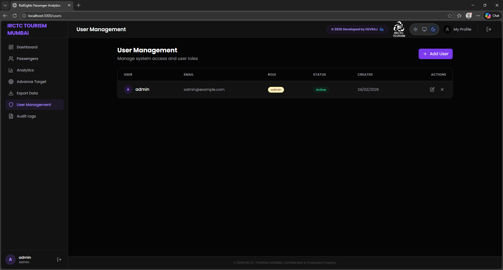

---

# 🚆 RAILSIGHTS

### Enterprise Passenger Analytics & Predictive Intelligence Platform

RAILSIGHTS is a full-stack enterprise analytics system engineered to manage and analyze **15,00,000+ passenger records** for large-scale tourism operations.

The platform combines high-performance backend processing, secure role-based access control, and AI-driven forecasting to deliver real-time business intelligence dashboards and predictive insights.

---

## 🏆 Key Impact Highlights

* 📊 Processed and optimized **1500k+ passenger records** with server-side pagination and indexed queries
* ⚡ Reduced dashboard data load time using efficient REST architecture
* 🔐 Implemented secure **JWT-based RBAC system** (Admin / Manager / Viewer)
* 📈 Built real-time analytics dashboards with dynamic visualizations
* 🧠 Designed predictive modeling module for seasonal demand forecasting
* 🕵️ Developed enterprise-grade audit logging for compliance & traceability
* 🌙 Built fully responsive dark/light UI with system sync

---

# 🧩 System Architecture

```
React Frontend (SPA)
        ↓
Flask REST API (JWT Secured)
        ↓
SQLAlchemy ORM
        ↓
SQLite (Dev) / PostgreSQL (Prod)
```

### Architectural Decisions:

* RESTful modular API structure
* Separation of concerns (Frontend / Backend / Data Layer)
* Token-based stateless authentication
* Optimized database queries for large datasets
* Production-ready WSGI deployment (Gunicorn / Waitress)

---

# 🌟 Core Features

## 📊 Real-Time Analytics Engine

* Revenue trend visualization
* Passenger demographic segmentation
* Booking performance metrics
* Interactive dashboards built with Recharts

## 🤖 Predictive Intelligence Module

* Historical data pattern analysis
* Seasonal tourism demand forecasting
* Targeted demographic analytics

## 🧾 Advanced Data Management

* Full CRUD for high-volume passenger data
* Server-side filtering, sorting & pagination
* Exportable reports

## 🔐 Role-Based Access Control

* JWT Authentication
* Route-level protection
* Role hierarchy enforcement

## 🕵️ Audit & Compliance Tracking

* Logs every user action
* Tracks modifications with timestamps
* Ensures accountability & security

---

# 🛠 Tech Stack

### Frontend

* React 18
* Tailwind CSS
* Recharts
* Lucide React

### Backend

* Python 3.8+
* Flask + Flask-RESTful
* SQLAlchemy
* Flask-JWT-Extended
* Gunicorn / Waitress

### Database

* SQLite (Development)
* PostgreSQL (Production)

---

# 🚀 Local Development Setup

## 1️⃣ Clone Repository

```bash
git clone https://github.com/your-username/railsights.git
cd railsights
```

---

## 2️⃣ Backend Setup

```bash
cd backend
python -m venv venv
source venv/bin/activate   # macOS/Linux
venv\Scripts\activate      # Windows
pip install -r requirements.txt
python reset_users.py
python app.py
```

Backend runs on:
`http://localhost:5000`

---

## 3️⃣ Frontend Setup

```bash
cd frontend
npm install
npm start
```

Frontend runs on:
`http://localhost:3000`

---

## 🔑 Default Credentials

| Role  | Username | Password |
| ----- | -------- | -------- |
| Admin | admin    | admin123 |

---

# 📸 Application Screens

* Authentication & Role Management


* Executive Analytics Dashboard


* Passenger Management System

* Predictive Target Analytics

* Audit Logs & Compliance View


* Data Export & Reporting

* User Management

---

# 📄 License

MIT License

---

<div align="center">
  <strong>Built with ❤️ by DEVRAJ</strong><br/>
  <sub>Full-Stack Engineering · Data Systems · Secure Enterprise Architecture</sub>
</div>

---

